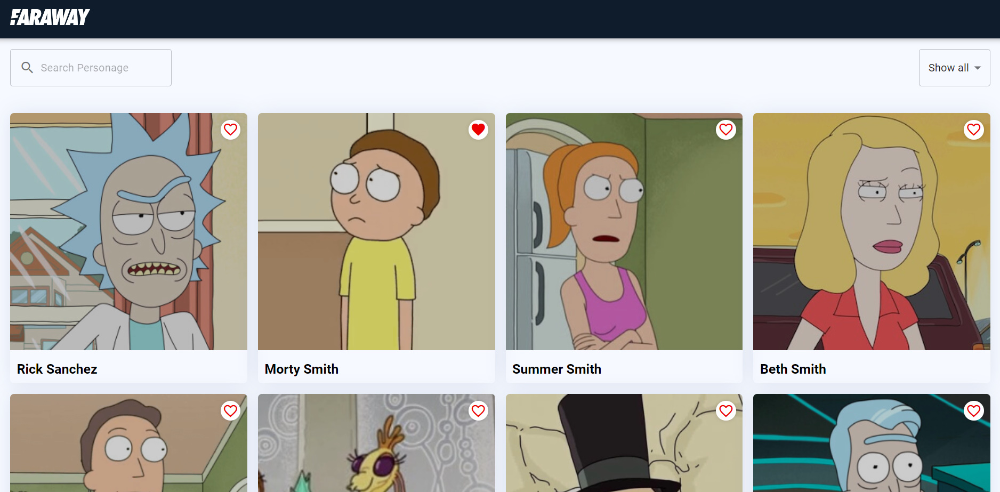

# Faraway test task

Сделал полностью на 100% все что запрашивалось в тестовом задании и использовал необходимые технологии.

Стэк: `Typescript, React, Redux, Material UI, Jest`

Функционал: `Карточки, пагинация, поиск, фильтрация, страница карточки, добавление в wishlist`

> Задание было для меня легким

## Preview



> Реализовал используя открытое [API The Rick and Morty](https://rickandmortyapi.com/)

### Installation

1. Clone the repo
   ```sh
   git clone https://github.com/favrora/react-api-task.git
   ```
2. Install NPM packages
   ```sh
   npm install
   ```
3. Build and run app:
   ```sh
   npm run start
   ```
4. App will run here => [http://localhost:3000](http://localhost:3000)
